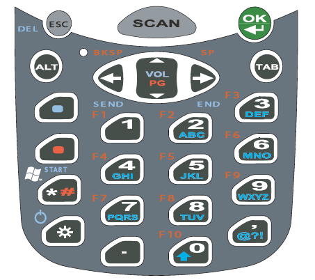

# Keyboards and UX

Before smartphones with touchscreens, the only way to enter information was via keyboards and, more specifically, keyboard combinations.&#x20;

Stop for a second and imagine using your smartphone without being able to tap the screen. Not a great experience for anyone.

It was my job to document the keyboards as part of documenting the entire device. After speaking with people in the Quality Assurance and Support departments over time, I realized that the keyboards and their combinations were the most important user content I could produce.&#x20;

### The Problem

The greatest challenge was that no one saw the keyboards assembled the way a user would until the first sample devices were manufactured. By the time we could see a physical sample, corrections and improvements cost more money and time than anyone wanted to spend.&#x20;

#### How the Documentation was Done

To document the keyboard combinations, I would receive a 20-page document from Engineering with the combinations for all three versions of the keyboard in a long table. Sometimes, this information was just a text file with comma-separated values.

The expected process was for me to just reformat the table in an addendum. No one liked this process, but it was the way it had always been done.

### My Solution

I had so much trouble figuring out the keyboard information from those text files that I could barely check my own work! I couldn't imagine how anyone could use that effectively.&#x20;

We needed to see the full keyboards before the first production run.&#x20;

* QA needed an easier and faster way to test.&#x20;
* Support needed a quick reference to troubleshoot issues.
* Product needed to be able to make changes and corrections before release.

Corrections and changes after a product release were expensive and unhappy customers even more so.

#### Step 1: Find the Images

Believing that there must be an assembled drawing of the keyboards somewhere, I went hunting and pecking through engineering drawings on the shared drive.&#x20;

The documents in this drive were PDFs with names assigned by the coding system according to ISO 9000 guidelines; in other words, they were not descriptive. Therefore, I had to open each PDF file to see what it contained.&#x20;

To my surprise, there were no images of the customer-facing keyboards. Instead, there were approximately five or six drawings, one for each layer of the keyboard. Each layer was layered on top of the others when manufactured.&#x20;

#### Step 2: Assembling the Keyboards in Adobe Illustrator

I developed the following method of assembling the keyboards:

1. Convert the PDFs of the keyboards to Adobe Illustrator.
2. Delete the engineering marks and information.
3. Layer each keyboard drawing on top of each other.
4. Align and arrange each layer.
5. Group the layers.
6. Save the final as a .png file.

Here is an example of a finished graphic:

&#x20;

#### Documenting the Keyboards

I documented the keyboard combinations as follows:

1. Insert the full keyboard graphic.
2. Create a table with only the combinations for that keyboard.

As my Adobe Illustrator skills developed, I was able to describe each key with an image and explanation.

### The Response

These images and the way I documented the keyboards as a result were such a success that I was thrilled, and so were the internal teams.

The QA and Support departments used to print color images of each keyboard and hang them in their cubicles to help them troubleshoot.

### The ROI

I was able to catch design errors and report them to the project manager prior to production, saving the company money.&#x20;

